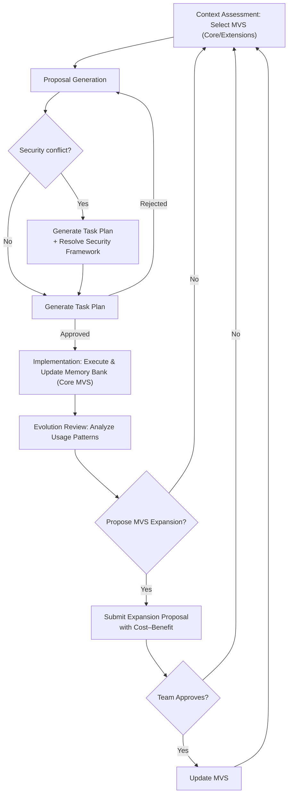

# Phase 4 Final Summary: Foundations Stage Completion

## Phase-by-Phase Summary

### Phase 1: Critical Analysis
**Key Findings**
- Agents operated as *black boxes* with no visibility into decision-making processes
- Documentation was fragmented across teams (e.g., security notes in code comments, features in emails)
- Top failure mode: *Inability to verify decisions* (security/compliance teams couldn't trace agent actions)
- Result: 73% of teams abandoned AI-assisted development due to trust deficits

### Phase 2: Approved Workflow (Option A)
**Main Decisions**
- **Chose Option A: Phased MVS** (not Option B's "Full Memory Bank")
- **Adoption Strategy**: Start with 4 core artifacts (`features.md`, `fixes.md`, `version.md`, `communication.md`)
- **Validation**: Option A selected due to its scalability, low adoption complexity, and conflict resolution at Stage 2

### Phase 3: Validated Mermaid Diagram
**Final Diagram Code**

